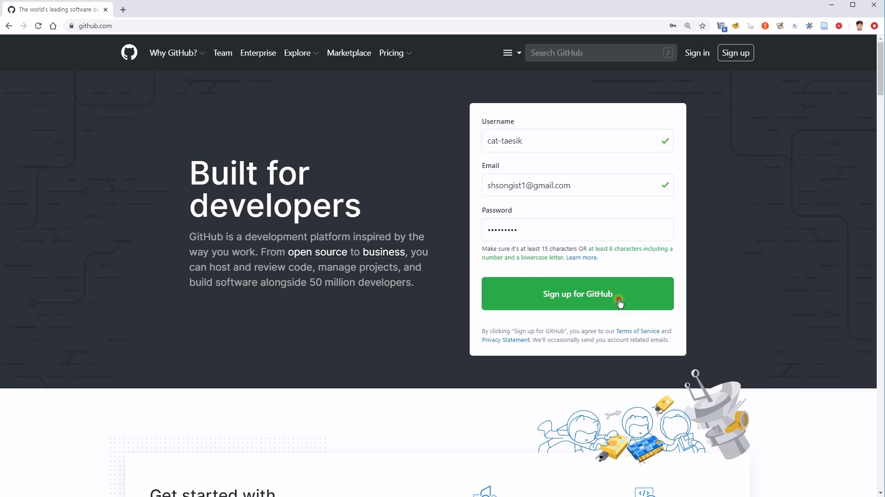
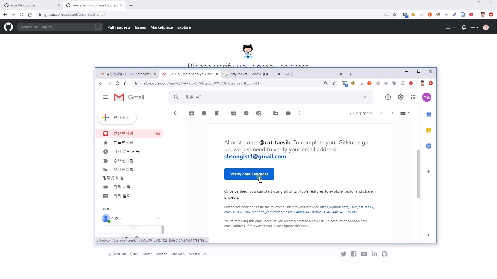
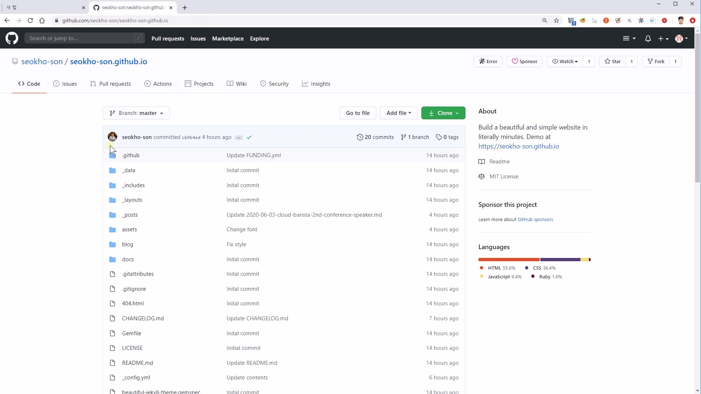

## 개요

GitHub로 10분 만에 개인 웹사이트 및 블로그 만들어 보는 가이드를 제공합니다.

이 가이드를 활용하여,

개인의 연구 커리어 정리 사이트, 연구 프로젝트의 사이트, 기술 블로그 개설 등 다양한 활용이 가능합니다.

{: .box-note}
이 포스트는 오픈소스 프로젝트의 주요 개발 플랫폼인 GitHub 경험 차원에서, **ETRI의 연구자들** 을 위해 게시하였습니다. &#128525;

{: .box-note}
- Git은 분산 버전 관리 시스템(DVCS, Distributed Version Control System) 입니다.
- GitHub는 Git을 사용하는 프로젝트의 관리를 도와주는 호스팅 서비스 입니다.

 

## 데모 웹사이트

데모 웹사이트 확인: [https://seokho-son.github.io](https://seokho-son.github.io)

 

## 웹사이트 생성 가이드

이 저장소를 활용하여 개인 웹사이트를 생성하는 방법 가이드

### 동영상 가이드

[동영상 가이드: 약 10분](https://www.youtube.com/watch?v=UgPZXxL2jSw)

<iframe width="770" height="432" src="https://www.youtube.com/embed/UgPZXxL2jSw" frameborder="0" allowfullscreen></iframe>

 

### 간단 GIF 가이드

가이드를 19 단계의 애니메이션으로 표현

 

### 상세 설명

1. GitHub 계정이 없는 경우, GitHub 계정을 생성하고 이메일 인증을 수행합니다.

   1. GitHub 계정 생성
      
   1. GitHub 계정 이메일 인증
      

1. 웹사이트의 기본 소스를 제공하는 GitHub 저장소에 접속하고, `Fork` 를 통해 해당 저장소를 본인의 GitHub 계정으로 복제합니다.

    1. [https://github.com/seokho-son/seokho-son.github.io](https://github.com/seokho-son/seokho-son.github.io) 저장소에 접속
       
    1. [https://seokho-son.github.io](https://seokho-son.github.io) 접속을 통해 데모 웹사이트 확인
       
    1. GitHub의 `Fork` 기능을 통해 저장소를 본인의 GitHub 계정으로 복제
       

       {: .box-note}
       `Fork` 는 Git 저장소를

* [발표영상](https://youtu.be/qxEnboezCFg)
* [발표자료](https://www.slideshare.net/cloud-barista/cloudbarista-2-multicloud-infrastructure-integrated-operation-management)
